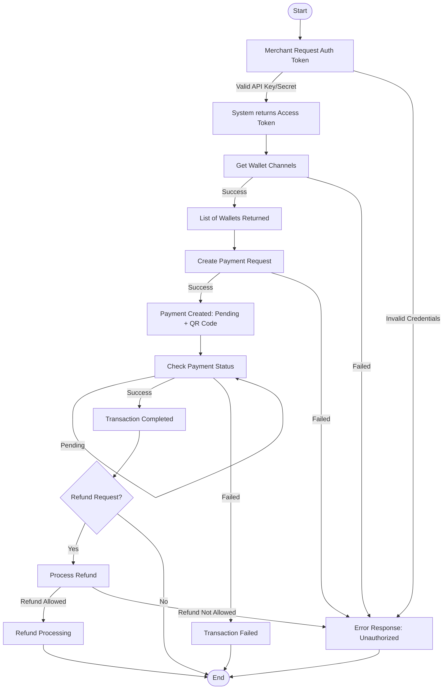

# POS Multiple E-Wallet API Documentation

The company is developing a **Payment Integration Platform** that allows merchants to connect their **Point-of-Sale (POS)** systems with multiple e-wallet providers (GoPay, OVO, Dana, ShopeePay).  

Merchants can use this API to:  
1. Authenticate securely.  
2. Retrieve available e-wallet channels.  
3. Create payment requests.  
4. Check transaction status.  
5. Handle refund requests.  

This API uses **Bearer Token Authentication** and all responses are returned in **JSON format**.  

---

## 🔎 Flowchart Overview



 ## 📌 API General Information

Base URL: https://hitmeapi.com:8080

Port: 8080

Authentication: Bearer Token

Format: JSON

| Endpoint                             | Description                      |
| ------------------------------------ | -------------------------------- |
| `POST /auth/token`                   | Authenticate & get access token. |
| `GET /wallets`                       | Retrieve available e-wallets.    |
| `POST /payments`                     | Create a payment request.        |
| `GET /payments/{payment_id}`         | Check payment status.            |
| `POST /payments/{payment_id}/refund` | Submit a refund request.         |

### 1. Authentication – Get Access Token

**Endpoint:**
```
POST https://hitmeapi.com:8080/auth/token
```

**Headers:**
```
Content-Type: application/json
```
| Header       | Value            |  Function (EN)                    |
| ------------ | ---------------- |  -------------------------------- |
| Content-Type | application/json |  Data format for request/response |

Example Request:
```
{
  "api_key": "your_api_key",
  "api_secret": "your_api_secret"
}
```
| Field        | Type   | Required | Description           |
| ------------ | ------ | -------- | --------------------- |
| `api_key`    | string | Yes      | Merchant’s API key    |
| `api_secret` | string | Yes      | Merchant’s secret key |


access_token → token to be used in subsequent API requests.

expires_in → token validity duration (in seconds).

**Response – Success:**
```
{
  "access_token": "eyJhbGciOiJIUzI1NiIsInR5cCI...",
  "expires_in": 3600
}
```
📌 Explanation :

access_token → token to be used in subsequent API requests.

expires_in → token validity duration (in seconds).

**Response – Failed:**
```
{
  "errorCode": "401",
  "errorType": "invalid_credentials",
  "errorMessage": "API key or secret is incorrect."
}
```
📌 Scenario : Occurs when the merchant provides an invalid api_key or api_secret.

💡 Non-Technical Description
This endpoint is used by merchants to log in. The response provides an access token required for other API calls.

### 2. Get Wallet Channels
**Endpoint**
```
GET https://hitmeapi.com:8080/wallets
```
**Header**
```
Authorization: Bearer <access_token>
```
| Header        | Value                 | Function (EN)                        |
| ------------- | --------------------- | ------------------------------------ |
| Authorization | Bearer <access_token> | Required Bearer token authentication |

🔹 Request Body
Tidak ada request body.
No request body required.

**Response - Success**
```
{
  "status": "success",
  "message": "Wallet channels retrieved successfully",
  "data": {
    "wallets": [
      { "id": "gopay", "name": "GoPay", "currency": "IDR" },
      { "id": "ovo", "name": "OVO", "currency": "IDR" },
      { "id": "dana", "name": "Dana", "currency": "IDR" },
      { "id": "shopeepay", "name": "ShopeePay", "currency": "IDR" }
    ]
  }
}
```
Explanation : API returns the list of available e-wallets.

**Response – Failed**

Unauthorized / Token Expired
```
{
  "status": "failed",
  "errorCode": "401",
  "errorType": "unauthorized",
  "errorMessage": "Access token is missing or expired."
}
```
Token is missing or expired.
```
{
  "status": "failed",
  "errorCode": "503",
  "errorType": "service_unavailable",
  "errorMessage": "Unable to retrieve wallet list at the moment. Please try again later."
}
```
service is currently unavailable.

💡 Non-Technical Description
This endpoint shows which e-wallets are available for customers (GoPay, OVO, Dana, ShopeePay).

### 3. Create Payment Request
**Endpoint**
```
POST https://hitmeapi.com:8080/payment 
```
**Header**
```
Content-Type: application/json  
Authorization: Bearer <access_token>/(example : "eyJhbGciOiJIUzI1NiIsInR5cCI...",)
```
| Header        | Value                 | Function (EN)                |
| ------------- | --------------------- | ---------------------------- |
| Content-Type  | application/json      | Request/response JSON format |
| Authorization | Bearer <access_token> | Required Bearer token        |

**Request Body**
| Field         | Type   | Required |  Description (EN)              |
| ------------- | ------ | -------- |  ----------------------------- |
| wallet\_id    | string | Yes      |  Target e-wallet ID            |
| amount        | number | Yes      | Payment amount                |
| currency      | string | Yes      | Currency code (e.g., IDR)     |
| order\_id     | string | Yes      | Unique merchant order ID      |
| callback\_url | string | No       |  Callback URL for notification |

**Example Request:**
```
{
  "wallet_id": "gopay",
  "amount": 150000,
  "currency": "IDR",
  "order_id": "ORD-102938",
  "callback_url": "https://merchant.com/callback"
}
```
**Response – Success**
```
{
  "payment_id": "pay_123456789",
  "status": "pending",
  "qr_url": "https://pay.example.com/qr/pay_123456789",
  "expires_at": "2025-08-28T12:30:00Z"
}

```
Merchant receives payment ID, pending status, and QR code URL for customer.

**Response – Failed**
```
{
  "status": "failed",
  "errorCode": "400",
  "errorType": "invalid_request",
  "errorMessage": "Missing field: wallet_id"
}

```
Missing field wallet_id → request failed.
💡 Non-Technical Description
Merchants use this endpoint to create a new transaction. A QR code/link is generated for payment.

##4. Check Payment Status
**endpoint**
```
GET https://hitmeapi.com:8080/payments/{payment_id}
```

| Header        | Value                 | Function              |
| ------------- | --------------------- | --------------------- |
| Authorization | Bearer <access_token> | Required Bearer token |
**header**
```
Authorization: Bearer <access_token>/(example : "eyJhbGciOiJIUzI1NiIsInR5cCI...",)
```
**Response Success**
```
{
  "payment_id": "pay_123456789",
  "order_id": "ORD-102938",
  "status": "success",
  "amount": 150000,
  "currency": "IDR",
  "wallet_id": "gopay",
  "paid_at": "2025-08-28T12:29:00Z"
}

```
API returns payment details and transaction status.

**Response – Failed**
```
{
  "status": "failed",
  "errorCode": "404",
  "errorType": "not_found",
  "errorMessage": "Payment not found"
}

```
Payment ID not found.

💡 Non-Technical Description
Merchants use this endpoint to check if a payment is successful, pending, or failed.

##5. Refund Payment
**Endpoint**
```
POST https://hitmeapi.com:8080/payments/{payment_id}/refund

```

**Header**
| Header        | Value                 | Function                     |
| ------------- | --------------------- | ---------------------------- |
| Content-Type  | application/json      | Request/response JSON format |
| Authorization | Bearer <access_token> | Required Bearer token        |```

```
Content-Type: application/json
Authorization: Bearer <access_token>/(example : "eyJhbGciOiJIUzI1NiIsInR5cCI...",)
``` 
**Example Request:**
```
{
  "amount": 50000,
  "reason": "Customer canceled order"
}
```
**Response – Success**
```
{
  "refund_id": "refund_987654321",
  "payment_id": "pay_123456789",
  "status": "processing",
  "amount": 50000
}

```
Refund successfully created with status processing.

**Response – Failed**
```
{
  "status": "failed",
  "errorCode": "409",
  "errorType": "refund_not_allowed",
  "errorMessage": "Refund not allowed for this transaction"
}
```
Refund cannot be processed for this transaction.

💡 Non-Technical Description
This endpoint is used by merchants to refund a payment if the order is canceled.
