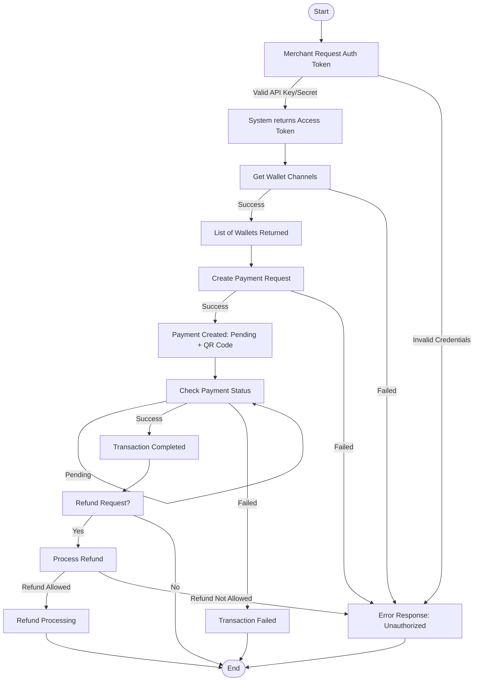

# POS Multiple E-Wallet
 Company Hitachi is developing a Payment Integration Platform that allows merchants to
connect Point-of-Sale (POS) systems with multiple e-wallet providers (GoPay, OVO,
Dana, ShopeePay). Merchants will use the API to:  
1. Authenticate securely.
2. Retrieve available e-wallet channels.
3. Create a payment request.
4. Check transaction status.
5. Handle refund requests 
The API uses Bearer Token authentication and returns responses in JSON format. 




**End Point** 
---
Domain: https://hitmeapi.com

Port: 8080

Authentication: Bearer Token

Format: JSON

## 1. Authentication – Get Access Token

### Request

POST [/token](https://hitmeapi.com/auth/token) 

### Headers
```
Content-Type: application/json  
Authorization: Bearer <access_token>
```
### Request Body
| Field        | Type   | Required | Description         |
| ------------ | ------ | -------- | ------------------- |
| `api_key`    | string | Yes      | API key merchant    |
| `api_secret` | string | Yes      | Secret key merchant |

### Example Request
```
body
{
  "api_key": "your_api_key",
  "api_secret": "your_api_secret"
}
```
### Response – Success
```
json
{
"access_token": "eyJhbGciOiJIUzI1NiIsInR5cCI...",
"expires_in": 3600
} 
```
### Respone - Failed
```
json
{
"errorCode": "200",
"errorType": "invalid_credentials",
"errorMessage": "API key or secret is incorrect."
}
```
Non-Technical Description (Merchant View)

Endpoint ini digunakan merchant untuk masuk ke sistem. Hasilnya adalah kunci akses (token) yang dipakai setiap kali memanggil API lain.

## 2. Get Wallet Channels
### Request

GET[/wallets](https://hitmeapi.com:8080/wallets)

### Headers
```
Content-Type: application/json  
Authorization: Bearer <access_token>/(example : "eyJhbGciOiJIUzI1NiIsInR5cCI...",)
```
### Request - body
```
json
{
  "wallets": [
    { "id": "gopay", "name": "GoPay", "currency": "IDR" },
    { "id": "ovo", "name": "OVO", "currency": "IDR" },
    { "id": "dana", "name": "Dana", "currency": "IDR" },
    { "id": "shopeepay", "name": "ShopeePay", "currency": "IDR" }
  ]
}
```
### Response – Success
```
{
  "status": "success",
  "message": "Wallet channels retrieved successfully",
  "data": {
    "wallets": [
      { "id": "gopay", "name": "GoPay", "currency": "IDR" },
      { "id": "ovo", "name": "OVO", "currency": "IDR" },
      { "id": "dana", "name": "Dana", "currency": "IDR" },
      { "id": "shopeepay", "name": "ShopeePay", "currency": "IDR" }
    ]
  }
}
```
### Response - Failed

```
{
  “errorCode”: “200”,
  "errorType": "invalid_credentials",
  "errorMessage": "API key or secret is incorrect."
}

```

internal server - error
```
{
  "status": "failed",
  "errorCode": "500",
  "errorType": "server_error",
  "errorMessage": "An unexpected error occurred on the server."
}
```
Skenario: Ada bug atau error di server API.

Wallet Service Unavailable
```
{
  "status": "failed",
  "errorCode": "503",
  "errorType": "service_unavailable",
  "errorMessage": "Unable to retrieve wallet list at the moment. Please try again later."
}
```

Unauthorized / Token Expired
```
{
  "status": "failed",
  "errorCode": "401",
  "errorType": "unauthorized",
  "errorMessage": "Access token is missing or expired."
}
```
## 3. Create Payment Request
POST[/payment](https://hitmeapi.com:8080/payment)

### Header
```
Content-Type: application/json  
Authorization: Bearer <access_token>/(example : "eyJhbGciOiJIUzI1NiIsInR5cCI...",)
```
### Request
```
json
{
  "wallet_id": "gopay",
  "amount": 150000,
  "currency": "IDR",
  "order_id": "ORD-102938",
  "callback_url": "https://merchant.com/callback"
}
```
### Response - success
```
{
  "payment_id": "pay_123456789",
  "status": "pending",
  "qr_url": "https://pay.example.com/qr/pay_123456789",
  "expires_at": "2025-08-28T12:30:00Z"
}
```
### Response - Failed

```
{
  “errorCode”: “200”,
  "errorType": "invalid_credentials",
  "errorMessage": "API key or secret is incorrect."
}

```
## 4. Create Payment Request
GET[/payments/{payments_id}](https://hitmeapi.com:8080/payment/{payments_id})

### Header
```
Content-Type: application/json  
Authorization: Bearer <access_token>/(example : "eyJhbGciOiJIUzI1NiIsInR5cCI...",)
```
### Response – Success
```
{
  "payment_id": "pay_123456789",
  "order_id": "ORD-102938",
  "status": "success",
  "amount": 150000,
  "currency": "IDR",
  "wallet_id": "gopay",
  "paid_at": "2025-08-28T12:29:00Z"
}
```

### Response - Failed
```
{
  “errorCode”: “200”,
  "errorType": "invalid_credentials",
  "errorMessage": "API key or secret is incorrect."
}
```

## 5. Refund Payment
### endpoint
POST[/payments/{payment_id}/refund](https://hitmeapi.com:8080/payment/{payments_id}/refund)

### header
```
Content-Type: application/json
Authorization: Bearer <access_token>/(example : "eyJhbGciOiJIUzI1NiIsInR5cCI...",)
``` 
| Field    | Type   | Required | Description               |
| -------- | ------ | -------- | ------------------------- |
| `amount` | number | Yes      | Jumlah uang yang direfund |
| `reason` | string | Yes      | Alasan refund             |


### Example Request
```
{
  "amount": 50000,
  "reason": "Customer canceled order"
}
```

Response – Success
```
{
  "refund_id": "refund_987654321",
  "payment_id": "pay_123456789",
  "status": "processing",
  "amount": 50000
}
```

Response – Failed
```
{
  “errorCode”: “200”,
  "errorType": "invalid_credentials",
  "errorMessage": "API key or secret is incorrect."
}
```


